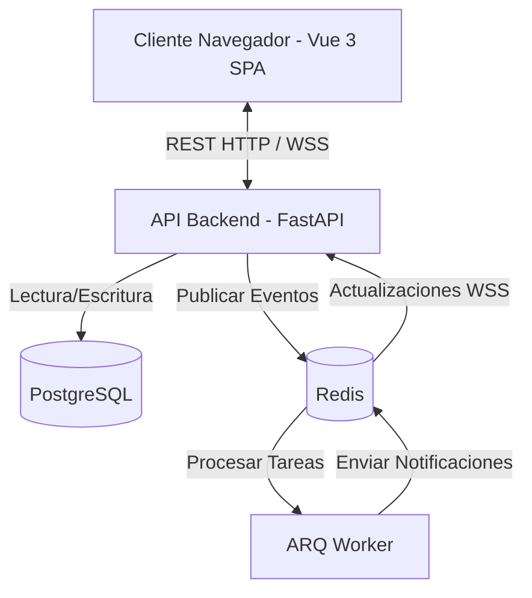

# Arquitectura de CoreStream

CoreStream es una plataforma de gestión de proyectos y tickets para equipos de desarrollo. Utiliza una arquitectura moderna y desacoplada con un frontend en Vue 3 y un backend en FastAPI.

## Resumen del Stack

| Capa | Tecnología |
|---|---|
| **Frontend** | Vue 3 + TypeScript + Vite + Pinia + Tailwind CSS |
| **Backend** | FastAPI (Python 3.11) |
| **Base de Datos** | PostgreSQL 15 |
| **Caché / Mensajería** | Redis 7 |
| **Tiempo Real** | WebSockets (vía pub/sub de Redis) |
| **Tareas en segundo plano** | ARQ (worker separado) |
| **Observabilidad** | Logging JSON + `request_id`, métricas Prometheus en `/metrics` |

## Flujo del sistema

## 1. Frontend (Vue 3)

El frontend es una Single Page Application (SPA) construida con la Composition API de Vue 3 y empaquetada con Vite. En producción se sirve como build estática detrás de un Nginx dedicado dentro de su propio contenedor (no el servidor de desarrollo de Vite, que rechaza hosts no incluidos en su allowlist).

- **Gestión de estado**: Pinia (`authStore`, `ticketsStore`, etc.).
- **Enrutamiento**: Vue Router, con un guard `beforeEach` asíncrono que espera a `authStore.ensureInitialized()` antes de decidir si redirigir.
- **Estilos**: Tailwind CSS.
- **Cliente HTTP**: Axios (`services/api.ts`), con `withCredentials: true` para la cookie de refresh y un interceptor que renueva el access token en un 401.
- **Tiempo real**: composable `useWebSocket` (estado a nivel de módulo, no por instancia) que abre la conexión tras obtener un ticket de un solo uso — ver sección de seguridad.

## 2. Backend (FastAPI)

El backend provee endpoints RESTful y conexiones WebSocket, asíncrono de punta a punta.

- **Capa de enrutamiento**: separada por dominios (`auth`, `tickets`, `epics`, `notifications`, `invitations`, etc.), bajo `app/routers/`.
- **Capa de servicios**: lógica de negocio en `app/services/` (máquina de estados de tickets, permisos, notificaciones, timers, traducción de documentos).
- **Acceso a datos**: SQLAlchemy 2.0 async ORM + asyncpg. Todas las relaciones usan `lazy="raise_on_sql"` (ver `app/models/base.py`) — un lazy-load olvidado falla ruidosamente en desarrollo y en CI en vez de convertirse en un 500 silencioso en producción.
- **Validación**: Pydantic v2, con `max_length` en los campos de texto de entrada.
- **Esquema de base de datos**: gestionado únicamente por Alembic (`alembic upgrade head` al arrancar el contenedor); si la migración falla, el contenedor no arranca.
- **Tareas en segundo plano**: un contenedor `worker` separado ejecuta ARQ sobre una cola propia (`corestream:arq:queue`, no el nombre por defecto de la librería) para no mezclarse con otros proyectos que puedan compartir el mismo Redis.

## 3. Base de datos (PostgreSQL)

Entidades clave:

- `users`, `roles`, `invitations` (alta de usuarios por invitación, no registro público)
- `applications`, `epics`, `tickets`, `subtasks`
- `ticket_events` (auditoría de las transiciones de estado)
- `notifications`
- `incidents`, `meetings` (soporte operativo y ceremonias de equipo)

## 4. Pub/Sub en tiempo real (Redis)

Redis sirve como columna vertebral para las funciones en tiempo real. Todos los canales y claves llevan el prefijo `corestream:` — el pub/sub de Redis **no** está aislado por índice de base de datos (`db N`), así que si la VM llega a compartir Redis con otro proyecto, el prefijo es la única barrera real.

Cuando cambia el estado de un ticket:

1. El backend guarda el cambio en PostgreSQL.
2. Se publica un evento en un canal de Redis (`corestream:tickets:updates` o `corestream:user:{id}:notifications`).
3. El worker de ARQ procesa el evento y lo entrega.
4. Las conexiones WebSocket activas reciben la carga JSON y actualizan el frontend.

El WebSocket usa dos tareas de larga vida coordinadas (una escuchando Redis, otra al cliente) con `asyncio.wait(..., return_when=FIRST_COMPLETED)` — el diseño anterior recreaba tareas en cada iteración de un bucle sin timeout real, lo que saturaba la CPU con conexiones inactivas.

## 5. Seguridad y autenticación

- **Tokens**: JWT de acceso (corta duración, en memoria del store de Pinia — nunca en `localStorage`) y de refresco (httpOnly, `SameSite=Strict`, solo viaja a `/api/auth/refresh`). Llevan un claim `type` (`access`/`refresh`) y un `jti` para poder revocarlos individualmente en logout.
- **CSRF**: patrón de doble envío (cookie legible `csrf_token` + cabecera `X-CSRF-Token`) en toda mutación que dependa de la cookie de refresh.
- **WebSocket**: se autentica con un ticket de un solo uso de 15s (`POST /api/auth/ws-ticket`), no con el JWT en el query string — evita que el token quede en los logs de acceso de un proxy.
- **Autorización (RBAC)**: `ADMIN`, `TEAM_LEADER`, `DEVELOPER`. Además de rol, hay comprobación de pertenencia (`app/services/ticket_permissions.py`): un `DEVELOPER` solo actúa sobre tickets que tiene asignados. Matriz completa en [`RBAC.md`](./RBAC.md).
- **Contraseñas**: bcrypt con un pre-hash SHA-256 (evita el límite de 72 bytes de bcrypt sin truncar la contraseña real).
- **Rate limiting**: contador en Redis por IP y por cuenta sobre `/auth/login`.
- **Alta de usuarios**: sin registro público — el primer ADMIN se crea con un script de un solo uso (`app/scripts/create_admin.py`); el resto, por invitación.

## 6. Empaquetado y despliegue

Dos perfiles de Docker Compose (no uno con condicionales):

- `docker-compose.yml` — producción: imágenes construidas, red bridge, solo backend/frontend/worker (Postgres y Redis son instancias ya existentes en la VM, compartidas con otros proyectos — no contenedores propios). Publica los puertos en `0.0.0.0`, igual que el resto de proyectos de esa VM: no hay Nginx local, el enrutamiento público es externo a la máquina; ver [`DEPLOYMENT.md`](./DEPLOYMENT.md).
- `docker-compose.dev.yml` — overlay de desarrollo: bind mounts, recarga en caliente, servidor de Vite, y sus propios Postgres/Redis descartables (en desarrollo local sí tiene sentido tener instancias propias, aisladas de cualquier infraestructura compartida).

Ver [`SETUP.md`](./SETUP.md) para desarrollo local y [`DEPLOYMENT.md`](./DEPLOYMENT.md) para el despliegue en la VM.
